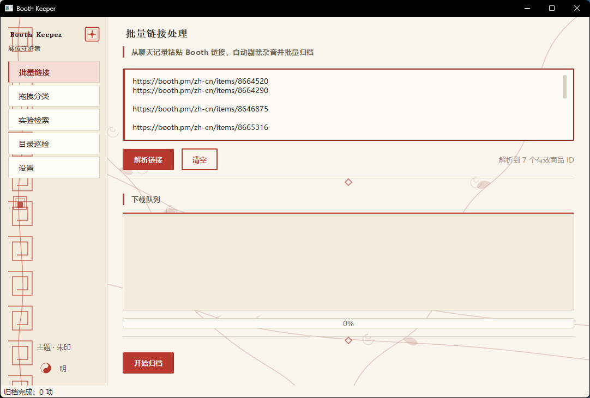
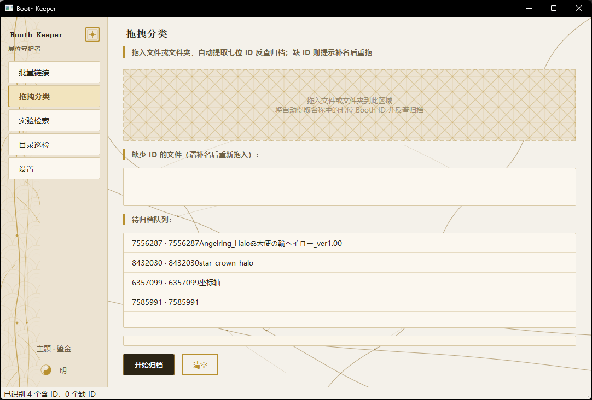
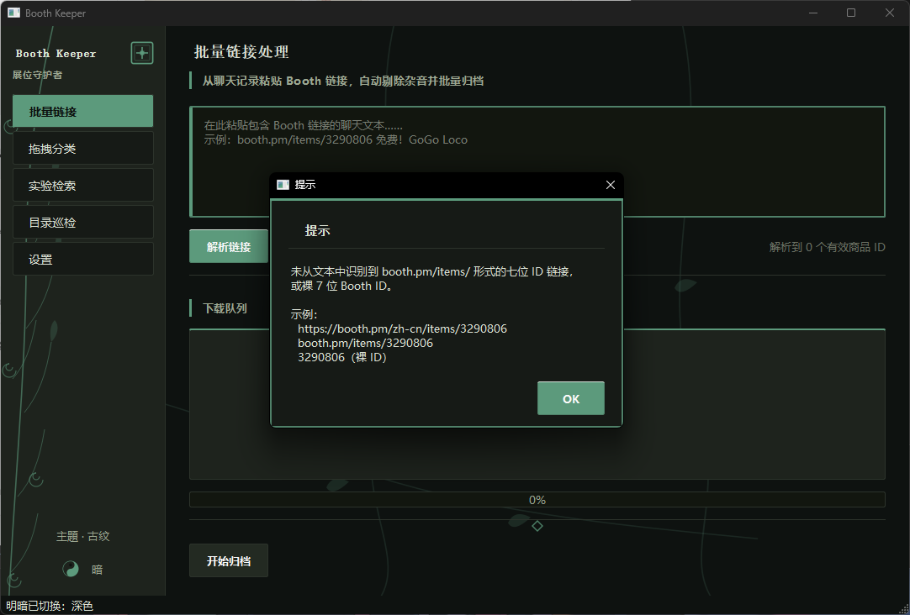
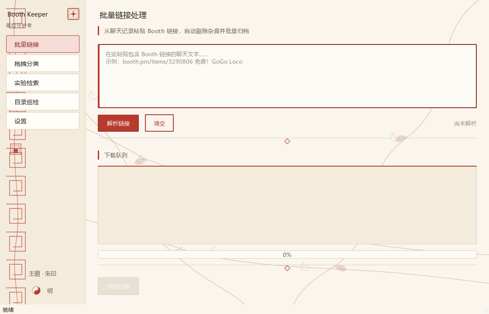
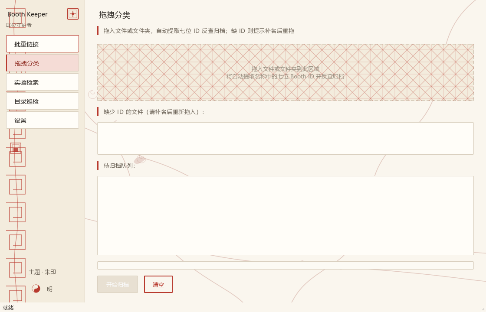
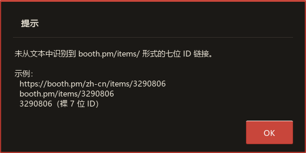
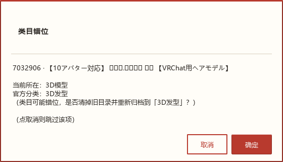

# Booth Keeper · 展位守护者

> 一站式 BOOTH.pm 资产整理桌面端：从聊天记录批量提取 Booth 链接、自动拖拽分类、目录巡检、版本巡检。开箱即用，单 exe 双击即可。
>
> 本软件的诞生契机：主上之前只做了基于 Agent 的 Booth 技能，但它局限在有 Agent / 有钱买 Token 的环境，**没法独立运行**。所以这次做了一个免费、开箱即用的桌面版——一个**鸡蛋**软件（自家头像也是鸡蛋，希望主上的 BOOTH 库也能像鸡蛋一样圆润滚入正确目录 🥚）。

PySide6 · Python 3.13 · 单 exe / 安装包 / zip 解压即用 · 无任何云端依赖

---

## 🎬 成果预览

> 真机截图，主上自用的状态（不是产品宣传图，含真实链接 + 队列数据）。

| 批量链接（朱印 · 明亮） | 拖拽分类（鎏金 · 明亮） |
| :---: | :---: |
|  |  |

| 主题化弹窗（古纹 · 暗色） |
| :---: |
|  |

> 离屏渲染图见 `preview_build/` 目录（含三主题 × 明暗整窗、隔离控件、母题底纹等共 60+ 张）。

---

## ✨ 核心功能

### I. 批量链接处理
从聊天记录批量复制的 BOOTH 链接中，**智能剔除杂音文本**，自动提取有效链接（含 `zh-cn` / `ja` / `en` / `ko` 等全 locale），批量加入下载队列，自动反查商品 → 下载封面 → 生成三件套图标 → 归档到对应类目。

### II. 拖拽文件识别分类
拖入文件或文件夹，自动提取名称中的 **七位 Booth ID**，反查对应商品链接进行分类。若缺 ID 则提示用户补名后重新拖入。

### III. 实验性检索
输入文件名 / 路径 / 关键词，自动生成多候选（去版本号、驼峰拆分、纯日文主体）依次搜索 BOOTH 匹配项，支持 Cookie/Token（设置页）。不保证 100% 准确，人工核对后一键归档。

### IV. 目录巡检 + 错位纠正
- **本地巡检**：遍历 BOOTH 库，定位 `ID_标题` 命名商品目录，检查三件套（`cover.jpg` / `.folder_icon.ico` / `desktop.ini`）完整性；
- **联网错位纠正**：同步联网比对官方分类与当前目录，错位项目一键重归档；
- **实验性版本巡检**：联网比对官方商品名中的版本号，发现更高版本时报告（更新前请人工核对）。

### V. 主题制 UI · 阴阳师风
三套主题循环（朱印 / 鎏金 / 古纹）+ 明暗两态，共 6 套配色。阴阳即明暗，太极按钮一键切换。每套主题自带差异化母题（朱红缠枝卷云 / 鎏金脉络 / 古纹叶脉），不是简单换色。

### VI. 主题化弹窗
所有提示、确认、警告均跟主题色同步，告别 OS 原生黑底黑字看不清（修复自 R6 验收反馈）。

### VII. 智能正则国际化
链接识别正则支持 `booth.pm/{locale}/items/{id}` 全 locale 形式（含 `zh-cn` / `ja` / `en` / `ko` / 无 locale），并兜底裸 7 位 ID 输入。目录命名识别支持 `ID_xxx` / `ID xxx`（空格）/ `ID-xxx`（连字符）/ `IDーxxx`（日文长音）等 6 种分隔符。

---

## 🚀 快速开始

### 下载与启动
三种分发形式按需选择：

| 形式 | 适合 | 体积 |
| --- | --- | --- |
| **Windows 安装包** `BoothKeeper_Setup_vX.X.X.exe` | 想放桌面/开始菜单快捷方式、要卸载程序列表管理 | ~75 MB |
| **zip 解压即用** `BoothKeeper_vX.X.X_portable.zip` | 不写注册表、绿色便携、想拷 U 盘用 | ~85 MB |
| **单 exe 懒人包** `BoothKeeper.exe` | 想拖到哪就双击（开发调试用） | ~75 MB |

1. 去 [Releases](https://github.com/linnnnnnnnnnnnnnnnnnnnn/booth-keeper/releases) 下载最新版本
2. **安装包**用户：双击 .exe → 一路 Next → 桌面/开始菜单出现图标
3. **zip**用户：解压到任意目录 → 进 `BoothKeeper/BoothKeeper.exe` 双击
4. **单 exe**用户：双击即可

首次启动请到「设置」页配置：
- **BOOTH 根目录**：默认 `G:\Lin_File\BOOTH`
- **代理**：默认 `http://127.0.0.1:20122/`（可选，用于 HK 节点）
- **Cookie**：可选，从浏览器 DevTools Network 抓 `booth.pm` 的请求 Cookie 填入（解锁付费内容预览与下载）

### 典型工作流
1. **拖拽分类**：把你混乱的「未分类」文件夹拖进来，工具自动识别 7 位 ID → 反查 BOOTH → 分类归档 → 下载封面 → 三件套图标
2. **批量链接**：把聊天记录里的 BOOTH 链接批量粘贴进来 → 一键解析 → 自动归档到正确类目
3. **目录巡检**：定期扫一遍你的 BOOTH 库，工具会发现三件套缺失、类目错位、官方版本更新等问题
4. **一键纠正错位**：巡检发现的类目错位项目，点「一键纠正」即可批量重归档

---

## ⚙️ 配置说明

设置页可配置：
- **主题**：朱印 / 鎏金 / 古纹（循环）
- **明暗**：明（#F4F1EA 釉底）/ 暗（#1A140A 玄底）
- **BOOTH 根目录**：默认为 `G:\Lin_File\BOOTH`
- **代理**：默认 `http://127.0.0.1:20122/`（主上的 HK 代理节点，需要时启用）
- **Cookie**：可选，从浏览器 DevTools Network 抓 `booth.pm` 的请求 Cookie 填入（解锁付费内容预览与下载）

---

## 📸 完整界面预览

| 批量链接（朱印 · 明亮） | 拖拽分类（鎏金 · 明亮） |
| :---: | :---: |
|  |  |

| 主题化弹窗（古纹 · 暗色） | 错位纠正对话框（朱印 · 明亮） |
| :---: | :---: |
|  |  |

> 完整 60+ 张主题图见项目内 `preview_build/` 目录（本地构建时生成，未入库）。

---

## 🛠️ 技术栈

- **UI 框架**：PySide6 6.11（Qt for Python）
- **打包**：PyInstaller 6.22（单 exe + onedir 双模式，UPX 压缩）+ NSIS（Windows 安装包）
- **网络层**：`requests`（BOOTH JSON API + HTML 搜索）
- **图像处理**：Pillow（封面缩放、ICO 多尺寸生成）
- **图标三件套**：Windows Shell API（`desktop.ini` + `.folder_icon.ico`）
- **正则**：Python `re`（支持全 locale + Unicode 字符类）

零云端依赖，所有分类 / 反查 / 巡检在本地完成。

---

## 🐛 常见问题

**Q: 提示「未从文本中识别到 booth.pm/items/ 形式的七位 ID 链接」？**
A: 链接识别支持 `zh-cn` / `ja` / `en` / `ko` / 无 locale 全格式。若仍有漏识，请贴一段文本给我排查。

**Q: 拖拽分类后「未分类」目录没清掉？**
A: R7+ 已加 `cleanup_empty_parents` walk-up，空目录链一键清理。隐藏文件（`desktop.ini` / `Thumbs.db`）不搬不删，留给 OS。

**Q: 巡检发现错位但不知道官方分类？**
A: R8 起「错位纠正」一键重归档，无需人工查。

**Q: 弹窗变成 OS 原生黑底黑字？**
A: 已修复（R6），所有弹窗走自建 `ThemeDialog` 跟主题。

---

## 🗓️ 更新日志

> 完整日志见 [`SCORE_TABLE_*.md`](SCORE_TABLE_R7.md)

- **R8（2026-08-14）** 巡检错位纠正：扫描同步联网比对，一键重归档
- **R7+1** 父级 3D 前缀规则（`衣装 + 3D_MODEL → 3D服饰` 等子分类映射根因）
- **R7** 空目录 walk-up 清理 / search archive 自动找源 / 巡检 verbose 日志
- **R6** fetch_item 规范化 / 链接 zh-cn 识别 / 主题化弹窗 / 侧栏截断修复
- **R5** 父样式表隔离根因 / 朱印去方块 / hline 去 @ / 输入框色差
- **R4** 三主题母题差异化（朱印/鎏金/古纹）/ hline 朱红边 / 输入框 4px 左规
- **R3** 鎏金脉络落地 / 七色 accent → 主题制重构 / 主题化 QSS 模板
- **R2** 单 exe 打包（PyInstaller + UPX）
- **R1** 四大核心功能（批量链接 / 拖拽分类 / 实验检索 / 目录巡检）首版

---

## ⚠️ 风险提示

- **Cookie 安全**：Cookie 是私密凭证，仅填到本地设置页，不要分享给他人。建议使用本地 Cookie 文件 + 文件权限保护。
- **代理节点**：使用第三方代理节点请确保来源可信；BOOTH 不会因为请求频率高封禁，但请合理使用。
- **数据安全**：所有操作（移动文件、生成图标、删除空目录）均在本地进行；删除操作有「错位/已存在」二次确认，不会无声删除。

---

## 📜 协议

MIT License — 你可以自由使用、修改、分发，但请保留原作者信息。

---

## ☕ 支持

如果这个工具帮到了你，欢迎支持主上继续维护：

### 🌟 精神支持（首选！）
- [GitHub Stars](https://github.com/linnnnnnnnnnnnnnnnnnnnn/booth-keeper) — 是主上继续迭代的最大动力 ✨
- [反馈 Issue](https://github.com/linnnnnnnnnnnnnnnnnnnnn/booth-keeper/issues) — bug / 建议 / 类目映射补充都欢迎

### ☕ 物质支持（不强求，看心情）

| 爱发电 | 微信 |
| :---: | :---: |
| [https://afdian.com/a/LinnYue](https://afdian.com/a/LinnYue) | 扫一扫 |

  

> 有了爱发电后，主上会有更多动力做下一款工具 ✨

---

## 🤝 贡献

欢迎 Issue / PR，特别是：
- BOOTH 类目映射补充（[booth_core.py:42-77](booth_core.py)）
- 主题母题 SVG 替换（[theme.py:208+](theme.py)）
- 新功能 / 新主题 / 新交互

主上风格：根因优先、像素核验、不做重复发明。

---

主上自用工具，分享给同样被 BOOTH 文件管理折磨的人。